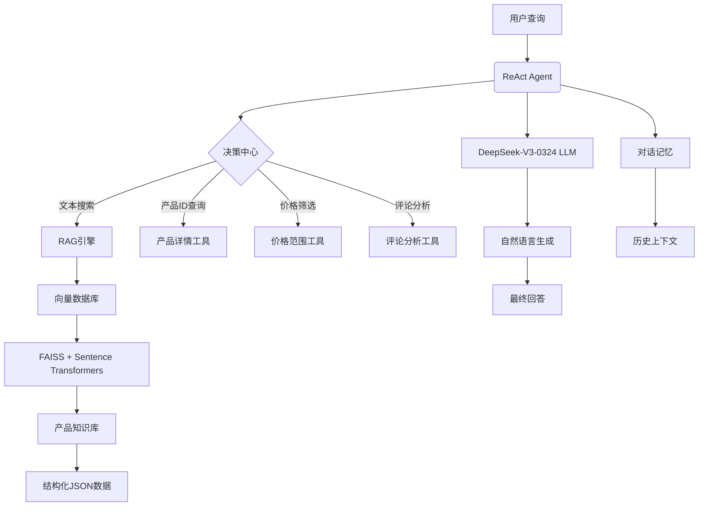

# Intelligent Shopping Assistant - 智能导购助手
https://cseweb.ucsd.edu/~jmcauley/datasets/amazon/links.html
# Intelligent Shopping Assistant with RAG & Agents

> 基于检索增强生成(RAG)和Agent架构的智能导购系统


## 🚀 核心特性

### 🔍 **检索增强生成 (Retrieval-Augmented Generation)**
- **上下文感知检索**：使用Sentence Transformers嵌入模型和FAISS向量数据库实现高效语义搜索
- **知识增强生成**：将检索到的产品信息整合到生成过程中，提供精准推荐
- **多语言支持**：paraphrase-multilingual-MiniLM嵌入模型支持中文等语言
- **高效向量化**：批处理处理大数据集，支持增量更新

### 🤖 **智能Agent架构**
- **工具驱动决策**：使用ReAct代理模式进行问题分解和工具选择
- **对话状态管理**：内置对话记忆，支持多轮上下文交互
- **专业领域工具**：
  - 🛍️ 产品搜索工具
  - 📊 产品详情获取工具
  - 💰 价格筛选工具
  - ⭐ 智能评论分析工具
- **自我调试能力**：内置错误处理和异常恢复机制

## ⚙️ 技术架构



## 💻 技术栈

| 组件类别       | 具体技术                          |
|----------------|-----------------------------------|
| **大语言模型** | DeepSeek-V3-0324 (OpenAI兼容API)  |
| **RAG引擎**    | FAISS + SentenceTransformers     |
| **代理框架**   | LangChain Agents                  |
| **数据处理**   | JSON/JSONL解析与处理              |
| **对话管理**   | Conversation Buffer Memory        |
| **嵌入模型**   | paraphrase-multilingual-MiniLM   |
| **开发语言**   | Python 3.10+                      |

## 📦 安装与使用

### 环境配置
```bash
# 克隆项目
git clone https://github.com/yourusername/rag-shopping-agent.git

# 安装依赖
pip install -r requirements.txt
```

### 配置文件
创建 `.env` 文件并添加DeepSeek API密钥：
```env
OPENAI_API_KEY=sk-your-api-key-here
OPENAI_API_BASE=https://api.deepseek.com/v1
```

### 数据准备
在 `./data` 目录添加产品知识库文件：
```bash
cp your_product_data.json ./data/product_knowledge_base.json
```

### 运行示例
```python
from shopping_assistant import IntelligentShoppingAssistant

# 初始化智能助手
assistant = IntelligentShoppingAssistant(
    json_file_path="data/product_knowledge_base.json",
    max_products=10000  # 可选加载限制
)

# 执行产品搜索
response = assistant.chat("帮我找预算200-500元内的无线蓝牙耳机")
print(response['output'])
```

## 💡 使用示例

**用户查询**：
> "我想买一个预算在1000-2000元的智能手机，需要拍照效果好，性能强劲"

**代理决策过程**：
1. 思考：用户需要特定价格范围的智能手机，重点在摄像头和性能
2. 行动：使用价格筛选工具 (1000,2000)
3. 观察：获取15款匹配产品
4. 思考：需进一步筛选摄影功能和性能
5. 行动：查询产品详情分析摄像头规格和处理器性能
6. 思考：基于评论分析用户反馈
7. 最终回复：提供3款最佳选择并附详细对比分析

**最终回复**：
```
根据您的需求，以下是三款推荐的高性能拍照手机：
1. Xiaomi 14 Pro (1999元)
   • 相机: 50MP主摄+超广角+长焦 | 徕卡专业镜头
   • 性能: 骁龙8 Gen3 | 12GB RAM
   • 评分: 4.7/5 (3200+评论)
   • 用户评价: "夜景拍摄出色，游戏流畅不发热"

2. OnePlus 12 (1899元)
   • 相机: 48MP主摄 | Hasselblad调校
   • 性能: 骁龙8 Gen3 | 16GB RAM
   • 评分: 4.8/5 (2800+评论)
   • 用户评价: "充电快，屏幕色彩精准"

3. Honor Magic5 Pro (1799元)
   • 相机: 三主摄系统 | 鹰眼抓拍技术
   • 性能: 骁龙8 Gen2 | 12GB RAM
   • 评分: 4.6/5 (2100+评论)
   • 用户评价: "电池续航优秀，日常使用丝滑"
```

## 📂 项目结构
```
intelligent-shopping-assistant/
├── data/                    # 数据存储目录
│   ├── product_knowledge_base.json    # 产品知识库（JSON/JSONL格式）
│   └── product_vectors/     # FAISS向量存储目录（自动生成）
│
├── src/                     # 源代码
│   ├── __init__.py
│   ├── agent.py             # ReAct代理实现
│   ├── knowledge_base.py   # RAG知识库管理
│   ├── models.py            # 数据模型定义
│   ├── tools.py             # 智能导购工具集
│   └── utils.py             # 工具函数
│
├── main.py                  # 命令行交互入口
├── requirements.txt         # Python依赖库
├── .env.example             # 环境配置示例
└── README.md                # 项目文档
```

## 🤝 贡献指南

我们欢迎您的贡献！请遵循以下步骤：

1. Fork项目仓库
2. 创建特性分支 (`git checkout -b feature/new-feature`)
3. 提交更改 (`git commit -am 'Add awesome feature'`)
4. 推送到分支 (`git push origin feature/new-feature`)
5. 创建Pull Request

**开发注意事项**：
- 保持代码风格一致
- 添加必要的单元测试
- 更新相关文档
- 使用类型注解(Type Hinting)

## 📜 许可证

本项目采用 MIT 许可证 - 详见 [LICENSE](LICENSE) 文件
