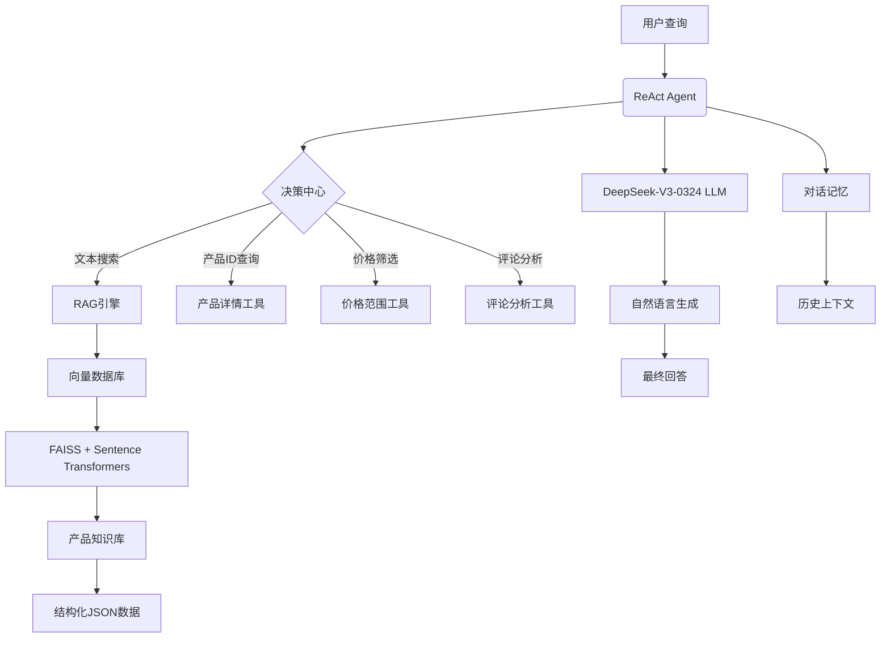

# Intelligent Shopping Assistant with RAG & Agents- 智能导购助手


##  核心特性

###  **检索增强生成 (Retrieval-Augmented Generation)**
- **上下文感知检索**：使用Sentence Transformers嵌入模型和FAISS向量数据库实现高效语义搜索
- **知识增强生成**：将检索到的产品信息整合到生成过程中，提供精准推荐
- **多语言支持**：paraphrase-multilingual-MiniLM嵌入模型支持中文等语言
- **高效向量化**：批处理处理大数据集，支持增量更新

###  **智能Agent架构**
- **工具驱动决策**：使用ReAct代理模式进行问题分解和工具选择
- **对话状态管理**：内置对话记忆，支持多轮上下文交互
- **专业领域工具**：
  -  产品搜索工具
  -  产品详情获取工具
  -  价格筛选工具
  -  智能评论分析工具
- **自我调试能力**：内置错误处理和异常恢复机制

##  技术架构



##  技术栈

| 组件类别       | 具体技术                          |
|----------------|-----------------------------------|
| **大语言模型** | DeepSeek-V3-0324 (OpenAI兼容API)  |
| **RAG引擎**    | FAISS + SentenceTransformers     |
| **代理框架**   | LangChain Agents                  |
| **数据处理**   | JSON/JSONL解析与处理              |
| **对话管理**   | Conversation Buffer Memory        |
| **嵌入模型**   | paraphrase-multilingual-MiniLM   |
| **开发语言**   | Python 3.10+                      |

##  安装与使用

## 配置文件
添加DeepSeek API密钥：

OPENAI_API_KEY=sk-your-api-key-here

OPENAI_API_BASE=https://api.deepseek.com/v1
```

## 数据准备
亚马逊商品数据：https://cseweb.ucsd.edu/~jmcauley/datasets/amazon/links.html
在该网站下载商品元数据meta和评论数据review


## 📜 许可证

本项目采用 MIT 许可证 - 详见 [LICENSE](LICENSE) 文件
